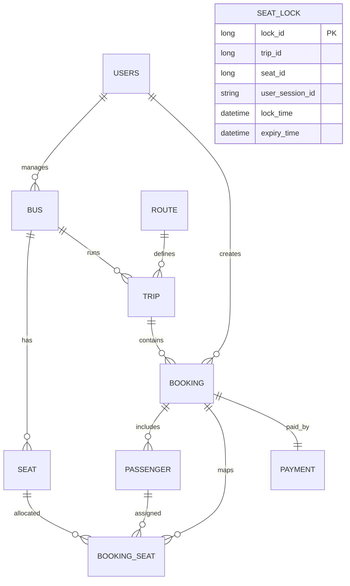
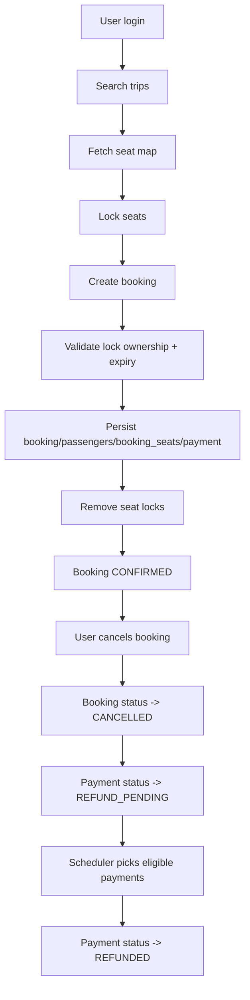

# Voyogo - Bus Booking Platform

Voyogo is a full-stack bus booking system with JWT authentication, role-based access, seat locking, booking, cancellation, refund scheduling, and admin analytics.

## Project Structure

```text
voyogo project/
  backend/voyogo/            # Spring Boot API (Java 21, PostgreSQL)
  frontend/voyogo-frontend/  # React + Vite client
```

## Tech Stack

- Backend: Spring Boot, Spring Security, Spring Data JPA, PostgreSQL, JWT, SpringDoc OpenAPI
- Frontend: React, Vite, Redux Toolkit, Axios, React Router
- Build tools: Maven, npm

## Setup

### Prerequisites

- Java 21
- Maven 3.9+
- Node.js 20+
- PostgreSQL 14+

### Backend (`backend/voyogo`)

1. Configure environment variables (or defaults in `application.yaml` are used):

- `DB_URL` (default: `jdbc:postgresql://localhost:5432/voyago`)
- `DB_USERNAME` (default: `postgres`)
- `DB_PASSWORD` (default: `root`)
- `JWT_SECRET`
- `JWT_EXPIRY_TIME` (default: `36000000`)
- `APP_CORS_ALLOWED_ORIGINS` (default: `http://localhost:5173`)
- `MAIL_HOST`, `MAIL_PORT`, `MAIL_USERNAME`, `MAIL_PASSWORD`

2. Run backend:

```powershell
cd backend/voyogo
./mvnw spring-boot:run
```

Backend runs on `http://localhost:8080`.

### Frontend (`frontend/voyogo-frontend`)

```powershell
cd frontend/voyogo-frontend
npm install
npm run dev
```

Frontend runs on `http://localhost:5173`.

## Authentication and Authorization

- Auth endpoints (`/voyago/auth/**`) are public.
- Swagger endpoints are public:
  - `/swagger-ui/index.html`
  - `/v3/api-docs`
- `/voyago/admin/**` requires `ROLE_ADMIN`.
- Other endpoints require valid JWT (`Authorization: Bearer <token>`).

## API Documentation (Swagger)

After backend startup:

- Swagger UI: `http://localhost:8080/swagger-ui/index.html`
- OpenAPI JSON: `http://localhost:8080/v3/api-docs`

## API Endpoints

Base URL used by frontend: `http://localhost:8080/voyago`

### Auth

- `POST /voyago/auth/signup` - Register user
- `POST /voyago/auth/login` - Login and get JWT

### User

- `GET /voyago/users/profile` - Get logged-in user profile

### Search and Booking

- `GET /voyago/buses/search?from={from}&to={to}&date={yyyy-MM-dd}` - Search trips
- `GET /voyago/buses/suggestions/source?keyword={text}` - Source suggestions
- `GET /voyago/buses/suggestions/destination?keyword={text}` - Destination suggestions
- `GET /voyago/buses/seats/trip/{tripId}` - Seat map with booked/locked flags
- `POST /voyago/seats/lock` - Lock seat for current user
- `DELETE /voyago/seats/unlock` - Unlock seat for current user
- `POST /voyago/buses/booking/create` - Create booking
- `GET /voyago/buses/bookings/my` - Logged-in user bookings
- `PUT /voyago/buses/booking/cancel/{bookingId}` - Cancel booking
- `GET /voyago/buses/refund-status/{bookingId}` - Refund status

### Admin

- `GET /voyago/admin/bus-types` - List bus types
- `POST /voyago/admin/buses` - Create bus
- `GET /voyago/admin/buses` - List buses
- `DELETE /voyago/admin/buses/{busNo}` - Soft/hard remove bus (service behavior)
- `GET /voyago/admin/bookings` - List all bookings
- `GET /voyago/admin/bookings/date?date={yyyy-MM-dd}` - Bookings by date

- `POST /voyago/admin/routes` - Create route
- `GET /voyago/admin/routes/search` - Get all routes
- `GET /voyago/admin/routes?page={0}&size={5}` - Get active routes (paged)
- `DELETE /voyago/admin/routes/{id}` - Deactivate route

- `POST /voyago/admin/trips` - Create trip
- `GET /voyago/admin/trips` - List active trips

- `GET /voyago/admin/analytics` - Revenue and booking analytics

## Database Schema (Entity Model)



## Main Tables and Purpose

- `users`: application users with roles (`USER`, `ADMIN`, `SUPER_ADMIN`)
- `bus`: bus inventory and ownership by admin
- `seat`: seat definitions per bus
- `route`: source/destination master with active flag
- `trip`: scheduled journey (bus + route + timing + fare)
- `booking`: user reservation, amount, status
- `passenger`: passenger details linked to booking
- `booking_seat`: unique seat assignment per trip (`trip_id + seat_id` unique)
- `payment`: one payment row per booking
- `seat_lock`: temporary lock rows for concurrency control

## Booking and Refund Workflow



## Status Enums

- Booking status: `CONFIRMED`, `CANCELLED`, `PENDING`, `REFUND_PENDING`, `SUCCESS`
- Payment status: `REFUND_PENDING`, `SUCCESS`, `PENDING`, `FAILED`, `REFUNDED`
- Bus type: `SLEEPER`, `AC_SEATER`, `NON_AC_SEATER`, `AC_SLEEPER`
- Seat type: `LOWER`, `UPPER`

## Notes

- API path prefix is currently `/voyago/**` in code.
- Refund and seat lock cleanup run on scheduled jobs.
- Route deletion is soft delete (`active=false`) in service.
